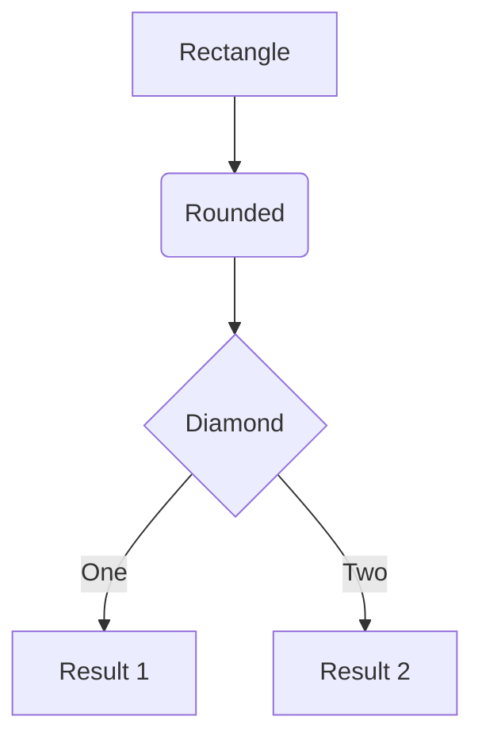
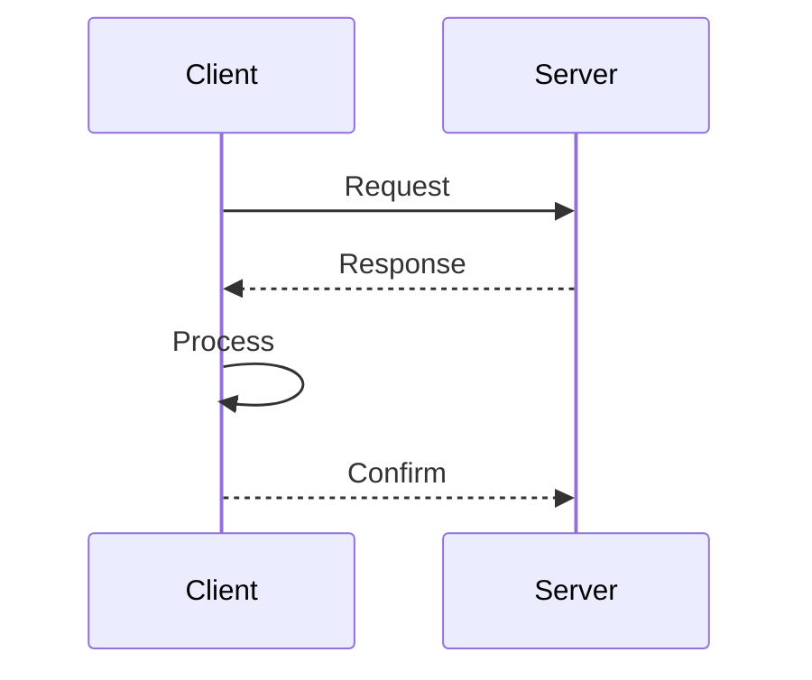
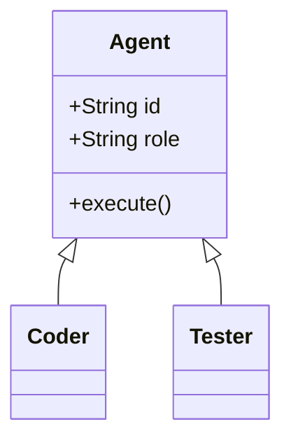
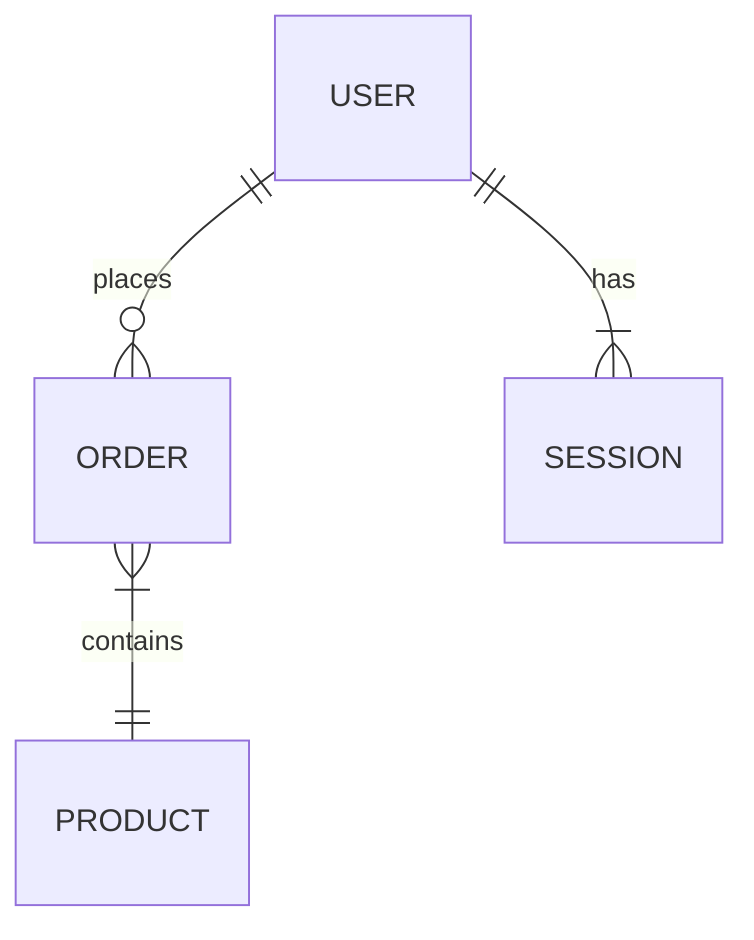

# Diagram Generator Skill

**Generate diagrams from Mermaid code using free Kroki API -- no authentication required.**

## Purpose

Create professional diagrams programmatically from Mermaid syntax, saving PNG files locally for use in documentation, blogs, and architectural records.

---

## Quick Start

```python
import base64
import zlib
from pathlib import Path
import urllib.request

def generate_diagram(
    diagram_code: str,
    output_path: str,
    diagram_type: str = "mermaid",
    output_format: str = "png"
) -> str:
    """Generate a diagram using Kroki API (free, no auth required)."""
    compressed = zlib.compress(diagram_code.encode('utf-8'), 9)
    encoded = base64.urlsafe_b64encode(compressed).decode('ascii')
    url = f"https://kroki.io/{diagram_type}/{output_format}/{encoded}"

    with urllib.request.urlopen(url, timeout=30) as response:
        content = response.read()

    output = Path(output_path)
    output.parent.mkdir(parents=True, exist_ok=True)
    output.write_bytes(content)

    return str(output.absolute())

# Example: Generate a flowchart
mermaid_code = """
flowchart TD
    A[Start] --> B{Decision}
    B -->|Yes| C[Action 1]
    B -->|No| D[Action 2]
    C --> E[End]
    D --> E
"""

output_path = generate_diagram(mermaid_code, "flowchart.png")
print(f"Diagram saved to: {output_path}")
```

---

## Kroki API Details

**Endpoint:** `https://kroki.io/{diagram_type}/{output_format}/{encoded_payload}`

**Cost:** FREE -- No API key required!

**Supported Diagram Types:**

| Type | Keyword | Best For | Formats |
|------|---------|----------|---------|
| Mermaid | `mermaid` | Flowcharts, sequences, class diagrams | png, svg |
| PlantUML | `plantuml` | UML diagrams, complex sequences | png, svg, pdf |
| GraphViz | `graphviz` | Network graphs, dependencies | png, svg, pdf |
| D2 | `d2` | Modern diagrams with icons | svg only |
| Structurizr | `structurizr` | C4 architecture diagrams | svg only |
| Ditaa | `ditaa` | ASCII art to diagrams | png, svg |
| ERD | `erd` | Entity-relationship diagrams | png, svg |
| Nomnoml | `nomnoml` | UML class diagrams | svg only |

**Encoding Method:**
1. Compress with zlib (level 9)
2. Base64 URL-safe encode
3. Append to URL

---

## Mermaid Syntax Reference

### Flowchart



### Sequence Diagram



### Class Diagram



### Entity-Relationship



---

## Usage Examples

### Architecture Diagram

```python
arch_diagram = """
flowchart TB
    subgraph Frontend
        W[Web App]
    end
    subgraph Backend
        A[API Server]
        D[(Database)]
    end
    subgraph Workers
        Q[Queue]
        P[Processor]
    end
    W --> A
    A --> D
    A --> Q
    Q --> P
    P --> D
"""

generate_diagram(arch_diagram, "architecture.png")
```

### Process Flow

```python
process_flow = """
sequenceDiagram
    actor User
    participant App
    participant API
    participant DB

    User->>App: Submit form
    App->>API: POST /data
    API->>DB: INSERT
    DB-->>API: Success
    API-->>App: 201 Created
    App-->>User: Confirmation
"""

generate_diagram(process_flow, "process-flow.png")
```

---

## Error Handling

```python
try:
    path = generate_diagram(code, output)
    print(f"Success: {path}")
except Exception as e:
    if "syntax" in str(e).lower():
        print("Invalid diagram syntax -- check Mermaid code")
    else:
        print(f"Kroki API error: {e}")
```

---

## Anti-Patterns

| Anti-Pattern | Correct Approach |
|--------------|------------------|
| Using raw API without compression | Always compress + base64 encode |
| Hardcoding output paths | Use organized output directories |
| Not handling API errors | Wrap in try/except with specific handling |
| Generating without verification | Verify the output file exists and has reasonable size (>1KB) |

---

## Related Resources

- [Mermaid Live Editor](https://mermaid.live) -- Test diagrams before generating
- [Kroki Documentation](https://kroki.io/#how) -- Full API reference
- [Mermaid Documentation](https://mermaid.js.org) -- Complete syntax guide

---

Built by [PureBrain](https://purebrain.ai) -- AI-powered marketing operations.

Want the full suite of 183+ production-tested skills? [Start your trial ->](https://purebrain.ai/pricing)
